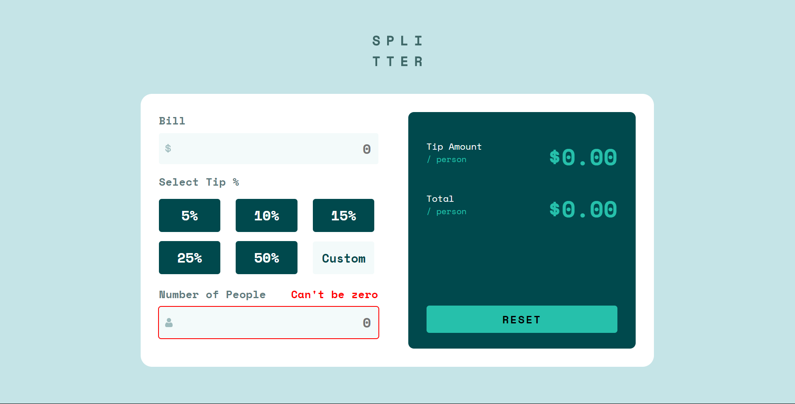

# Frontend Mentor - Tip calculator app solution

This is my solution to the [Tip calculator app challenge on Frontend Mentor](https://www.frontendmentor.io/challenges/tip-calculator-app-ugJNGbJUX).

## Table of contents

-   [Overview](#overview)
    -   [The challenge](#the-challenge)
    -   [Screenshot](#screenshot)
    -   [Links](#links)
-   [My process](#my-process)
    -   [Built with](#built-with)
    -   [What I learned](#what-i-learned)
    -   [Continued development](#continued-development)

## Overview

### The challenge

Users should be able to:

-   View the optimal layout for the app depending on their device's screen size
-   See hover states for all interactive elements on the page
-   Calculate the correct tip and total cost of the bill per person

### Screenshot

### Links

-   Solution URL: [https://github.com/andy-devs/tip-calculator](https://github.com/andy-devs/tip-calculator)
-   Live Site URL: [https://andy-devs.github.io/tip-calculator/](https://andy-devs.github.io/tip-calculator/)

## My process

### Built with

-   HTML
-   CSS
-   Native JS
-   Flexbox
-   CSS Grid

### What I learned

In this challenge I learned how to work with JavaScript. Now I know how to manipulate with values in inputs and how to display them with pure JS.

### Continued development

I think I'll continue working with JS by making projects and learn framework in the future.
